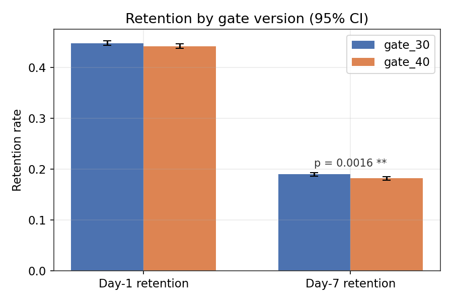
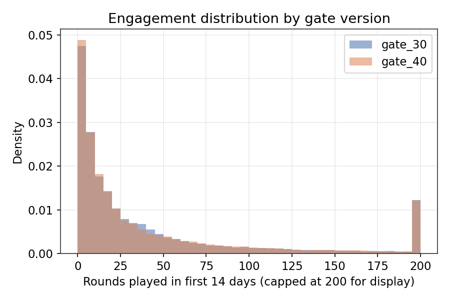
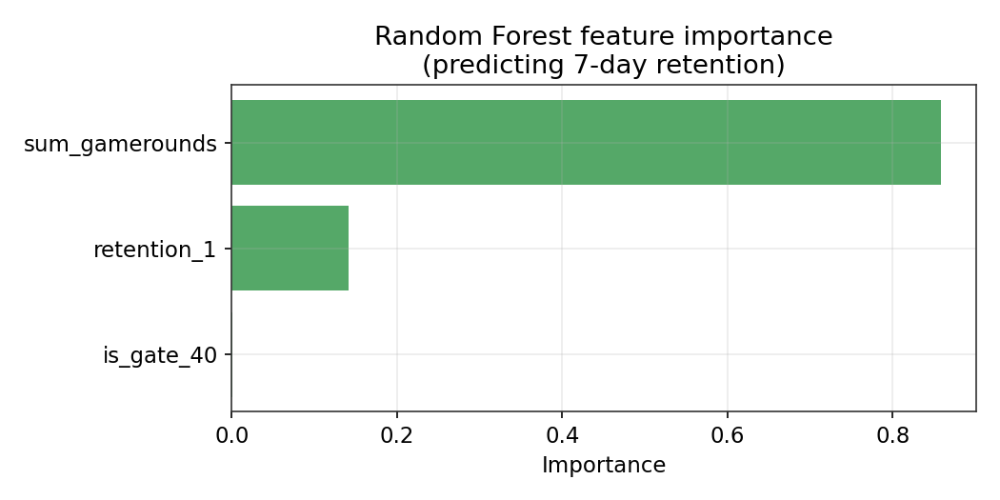
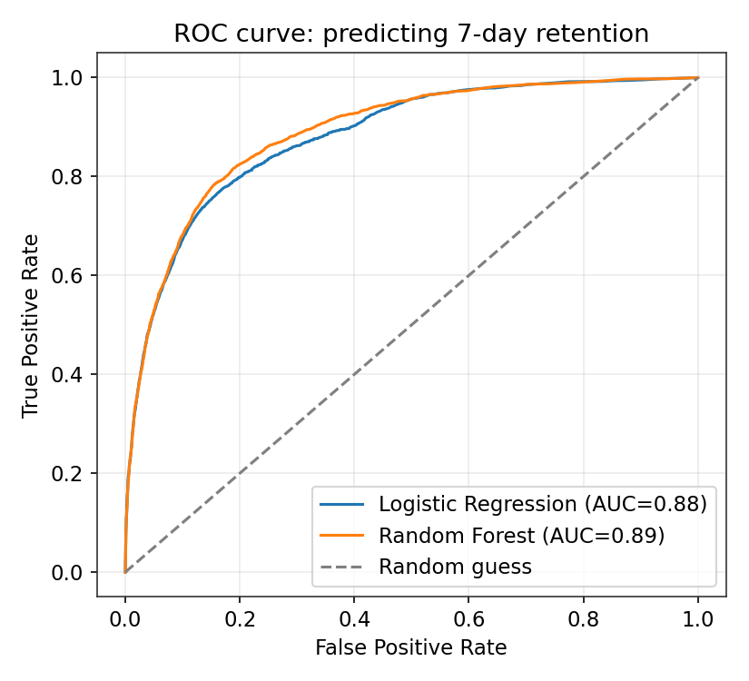

# 🍪 A/B Testing Analysis Tool & Predictive Modeling


An end-to-end experimentation pipeline on a real mobile-game A/B test:
**clean data → SQL segmentation → statistical hypothesis testing → predictive
modeling → plain-English report.** Built to mirror how an actual product
analytics workflow moves from raw data to a shippable recommendation.

**Dataset:** [Cookie Cats mobile game A/B test](https://www.kaggle.com/datasets/yufengsui/mobile-games-ab-testing) — 90,189 players.

---

## The question

Cookie Cats moved its first "gate" (a forced wait/purchase point) from
level 30 to level 40. **Does that hurt or help player engagement?**

## TL;DR

| Metric | gate_30 | gate_40 | Result |
|---|---|---|---|
| Day-1 retention | 44.8% | 44.2% | not significant (p=0.074) |
| **Day-7 retention** | **19.0%** | **18.2%** | **significant, p=0.0016** ⚠️ |
| Rounds played (median) | 17 | 16 | not significant (p=0.051) |

**Recommendation: keep the gate at level 30.** The only metric that moved
with statistical confidence went in the wrong direction, with no offsetting
engagement gain to justify the change.



---

## Digging deeper: where does the effect come from?

Slicing 7-day retention by engagement level (via SQL — see below) shows the
drop isn't spread evenly:

| Engagement bucket | gate_30 | gate_40 |
|---|---|---|
| 0 rounds (never started) | 0.8% | 0.6% |
| 1–10 rounds (light) | 1.9% | 1.9% |
| 11–50 rounds (moderate) | 12.0% | 10.8% |
| 51–200 rounds (heavy) | 47.6% | 44.7% |
| 200+ rounds (whale) | 84.9% | 85.0% |

- **Activation is unaffected** — near-identical shares of each group never play a single round.
- **Power users retain equally well either way** — once someone's hooked, gate position stops mattering.
- **The drop concentrates in the moderate/heavy segment** — engaged-but-not-yet-diehard players, exactly who a later gate is meant to slow down.



---

## Predictive modeling

Separately from the A/B test: *can early behavior predict who comes back?*

A Random Forest predicts 7-day retention with **ROC-AUC = 0.89** (vs. an
18.6% baseline retention rate) — and it's not gate version doing the work:




`sum_gamerounds` alone explains most of the model's predictive power —
**how much someone plays in the first 14 days matters far more for
retention than which gate they saw.** Product effort is better spent on
early-engagement hooks (onboarding, early rewards) than on gate tuning.

---

## Project structure

```
├── data/
│   ├── cookie_cats.csv          # raw dataset
│   ├── cookie_cats_clean.csv    # after cleaning (generated)
│   └── cookie_cats.db           # SQLite database (generated)
├── sql/
│   ├── schema.sql                # table definition
│   └── queries.sql               # 4 analysis queries (segmentation, activation, power-user decile)
├── src/
│   ├── data_cleaning.py         # dedup, nulls, gap-based outlier detection
│   ├── sql_analysis.py          # loads SQLite, runs sql/queries.sql
│   ├── ab_test_analysis.py      # two-proportion z-test, Mann-Whitney U
│   ├── predictive_model.py      # logistic regression + random forest
│   ├── plots.py                 # generates all figures below
│   └── report.py                # builds reports/summary_report.md
├── reports/
│   ├── figures/                  # generated PNGs (embedded above)
│   └── summary_report.md         # generated plain-English report
├── main.py                       # runs the full pipeline
└── requirements.txt
```

## Running it

```bash
pip install -r requirements.txt
python3 main.py
```

This regenerates `data/cookie_cats_clean.csv`, `data/cookie_cats.db`,
every figure in `reports/figures/`, and `reports/summary_report.md`.

## Methodology notes

- **Outlier detection** uses a gap-based rule, not a blind z-score: the raw
  data has genuine "whale" players with 1,000–3,000 rounds, so a standard
  cutoff would wrongly discard real users. The rule instead looks for the
  one jump in sorted values that dwarfs all others — isolating a single
  implausible row (49,854 rounds in 14 days) without touching legitimate
  heavy players.
- **SQL first, then Python**: `sql/queries.sql` reproduces the headline
  numbers directly against a SQLite table (as they'd first be checked
  against a warehouse in practice) and adds segment-level slicing —
  engagement buckets and a `NTILE`-based power-user decile — that's more
  natural in SQL than pandas.
- **Mann-Whitney U** (not a t-test) for `sum_gamerounds` because the
  distribution is heavily right-skewed — a t-test's normality assumption
  doesn't hold here.
- **Logistic regression + random forest** are both trained so the report
  can compare an interpretable baseline against a stronger model, using
  the random forest's feature importances to explain *why* it predicts
  what it predicts.
